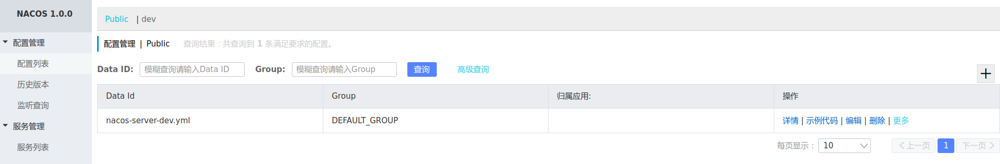

# springcloud-demo
## springcloud 官网简介以及maven版本依赖　　
https://spring.io/projects/spring-cloud#learn
https://mvnrepository.com/artifact/org.springframework.cloud/spring-cloud-dependencies

## 服务注册发现
### eureka server
1.springcloud-server为例  
pom.xml中引入  
spring-cloud-starter-netflix-eureka-server  
2.启动类上加上@EnableEurekaServer注解,声明为服务注册中心  
3.注册中心yml配置说明  
&emsp;详见springcloud-server-registered的application.ym  　
### eureka client
1.其他服务注册到注册中心  
&emsp;1.1 springcloud-client为例  
&emsp;&emsp;引入spring-cloud-starter-netflix-eureka-client,spring-cloud-starter-openfeign依赖.服务启动类上加入@EnableEurekaClient注解声明为eureka服务的客户端.@EnableFeignClients,声明为feign的客户端.后面讲解用处.  
&emsp;1.2 yml配置  
&emsp;&emsp;详见springcloud-client的application.yml配置  　　
&emsp;&emsp;notice:默认注册使用主机名注册　　
.png)　　
会取/etc/hosts里面的主机名(windows system32 driver etc hosts文件)　　
### feign client
feign的原理以及熔断使用和异常处理详细内容见demo-client注释.  　　
feign默认是集成了熔断和负载的.熔断相关看配置文件,默认负载开启的,只需要２个服务示例即可,都是客户端负载.  
如果使用restTemplate调用不使用feign需要配置  
  　@LoadBalanced
    @Bean
    RestTemplate restTemplate() {
        return new RestTemplate();
    }
 就可实现负载.  
 notice:当使用restTemplate调用第三方服务的时候需要另外注入一个Bean,取别名,并且不能添加@LoadBalanced注解　　
 ### zuul
 springcloud网关一般有zuul和gateway,本项目介绍了zuul的静态路由和动态路由的实现.  
 pom.xml引入spring-cloud-starter-netflix-zuul模块,启动类上加上@EnableZuulProxy注解就能使用  
 代码见项目中springcloud-zuul模块  
 其中zuul不管动态还是静态路由对象ZuulProperties这个类来封装路由信息,详见CustomRouteLocator自定义类的实现了解原理.  
 notice:建议动态自定义路由时候id自增.
 ### nacos
 添加maven依赖
 
     <dependency>
         <groupId>org.springframework.cloud</groupId>
         <artifactId>spring-cloud-starter-alibaba-nacos-discovery</artifactId>
         <version>0.2.2.RELEASE</version>
     </dependency>
 
     <dependency>
         <groupId>org.springframework.cloud</groupId>
         <artifactId>spring-cloud-starter-alibaba-nacos-config</artifactId>
         <version>0.2.1.RELEASE</version>
     </dependency>
  
  1.创建bootstrap.yml文件(必须是bootstrap.yml不能是application.yml,启动时候最优先读取必须是bootstrap.yml)  
  server:  
&emsp;    port: 8766  
  spring:  
&emsp;&emsp;application:  
&emsp;&emsp;&emsp;name: nacos-server  
&emsp;&emsp;cloud:  
&emsp;&emsp;&emsp;nacos:  
&emsp;&emsp;&emsp;&emsp;config:  
&emsp;&emsp;&emsp;&emsp;&emsp;server-addr: 127.0.0.1:8848  
&emsp;&emsp;&emsp;&emsp;&emsp;file-extension: yml  
&emsp;&emsp;&emsp;&emsp;discovery:  
&emsp;&emsp;&emsp;&emsp;&emsp;server-addr: 127.0.0.1:8848  
&emsp;&emsp;profiles:  
&emsp;&emsp;&emsp;active: dev  
  在启动类上加入 @EnableDiscoveryClient 注解
  2. nacos官网下载nacos客户端下载安装  
  https://nacos.io/zh-cn/  
  进入bin目录执行　bash -f ./startup.sh -m standalone & 启动nacos,默认端口8848   
 输入localhost:8848进入ui页面在配置列表选项中创建对应的配置文件
　
　3. 关于nacos的动态刷新配置,默认是开启的,实现原理详见@See ClientWorker类　  
 &emsp;其构造方法中的LongPullingRunnable一个长轮询任务,将轮询到有变化的DataId放入CacheData类.  
 &emsp;其中CacheData中注册了Listener,通过NacosContextRefresher类刷新配置.    　
  
  
  
 
 

